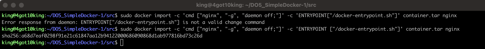
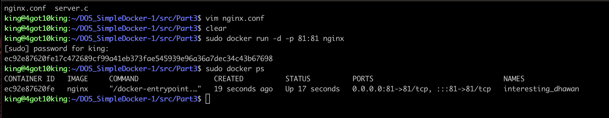
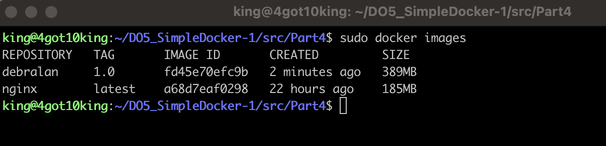

# Simple Docker

## Содержание 

1. [Part 1. Готовый докер](#Part 1. Готовый докер) 
2. [Part 2. Операции с контейнером](#Part 2. Операции с контейнером) 
3. [Part 3. Мини веб-сервер](#Part 3. Мини веб-сервер)
4. [Part 4. Свой докер](#Part 4. Свой докер)
5. [Part 5. Dockle](#Part 5. Dockle)
6. [Part 6. Базовый Docker Compose](#Part 6. Базовый Docker Compose)

## Part 1. Готовый докер <a name="Part 1. Готовый докер"></a>

+ Взяли официальный докер образ с nginx и скачали его при помощи docker `docker pull`


+ Проверили наличие докер образа через `docker images`


+ Запустили докер образ через `docker run -d [image_id|repository]`

> **-d:** это флаг, который указывает Docker на запуск контейнера в фоновом режиме (detached mode). Это означает, что контейнер будет работать в фоновом режиме, и командная строка будет освобождена для дальнейшего использования.
>


+ Проверили, что образ запустился через `docker ps`


>Команда `docker ps` используется для вывода списка запущенных контейнеров Docker.  
>При запуске команды `docker ps` без дополнительных флагов будут отображены только запущенные контейнеры в текущий момент времени.
>

+ Посмотрели информацию о контейнере через `docker inspect [container_id|container_name]`


+ размер контейнера


+ список замапленных портов


>Маппинг нужен для того, чтобы все запросы, проходящие через порт хоста, перенаправлялись в Docker-контейнер. Другими словами, сопоставление портов делает процессы внутри контейнера доступными извне.
>

+ ip контейнера


+ Остановили докер образ через `docker stop [container_id|container_name]` и проверили, что образ остановился через `docker ps`


+ Теперь запустим docker-образ с портами 80:80 и 443:443 чере команду  `docker run`


+ Проверили, что в браузере по адресу localhost:80 доступна стартовая страница `nginx`


+ Перезапустили докер контейнер через `docker restart [container_id|container_name]` и проверили, что контейнер запустился


## Part 2. Операции с контейнером <a name="Part 2. Операции с контейнером"></a>

+ Прочитали конфигурационный файл `nginx.conf` внутри докер контейнера через команду `exec`


+ Теперь создадим локальный файл `nginx.conf` при помощи команды `touch nginx.conf` и настроем в нем выдачу страницы-статуса сервера по пути `/status`


+ Наконец, перенесем созданный файл внутрь docker-образа командой `docker cp`


+ И перезапустим nginx внутри docker-образа командой `docker exec [container_id|container_name] nginx -s reload`


+ Убедимся, что все работает, проверив страницу по адресу `localhost/status`


+ Теперь экспортируем наш контейнер в файл `container.tar ` командой `docker export`


+ Затем удалим образ командой `docker rmi -f [image_id|repository]` , не удаляя перед этим контейнеры


+ После чего удалим остановленный контейнер командой `docker rm [container_id|container_name]`


+ Теперь импортируем контейнер обратно командой `docker import` и запустим импортированный контейнер уже знакомой командой `docker run` 




+ Наконец проверим, что по адресу `localhost/status `выдается страничка со статусом сервера nginx


## Part 3. Мини веб-сервер <a name="Part 3. Мини веб-сервер"></a>

+ Чтобы создать свой мини веб-сервер, необходимо создать .c файл, в котором будет описана логика сервера (в нашем случае - вывод сообщения `Hello World!`), а также конфиг `nginx.conf`, который будет проксировать все запросы с порта 81 на порт 127.0.0.1:8080


+ Теперь выкачаем новый docker-образ и на его основе запустим новый контейнер 



+ После перекинем конфиг и логику сервера в новый контейнер


+ Затем установим требуемые утилиты для запуска мини веб-сервера на FastCGI, в частности `spawn-fcgi` и `libfcgi-dev`


+ Наконец скомпилируем и запустим наш мини веб-сервер через команду `spawn-fcgi` на порту 8080


+ Чтобы удостовериться, что все работает корректно, проверим, что в браузере по адресу `localhost:81` отдается написанная нами страница


```
Если во время развертывания сервера в контейнере у вас возникнут непредвиденные ошибки, например, неправильно написанный конфиг или что-то вроде, из-за чего сервер будет работать некорректно, вам придется убить старый процесс при помощи команды [kill] по его PID, узнать который можно благодаря утилите [sockstat] командой [sockstat -lu], что показано на приведенном ниже скриншоте. После описанных манипуляций вы сможете вновь развернуть сервер на необходимый порт
```

## Part 4. Свой докер <a name="Part 4. Свой докер"></a>

+ Напишем свой docker-образ, который собирает исходники 3-й части, запускает на порту `80`, после копирует внутрь написанный нами `nginx.conf` и, наконец, запускает `nginx` (ниже приведены файлы `run.sh` и `Dockerfile`, файлы `nginx.conf` и `server.c` остаются с 3-й части)


+ Соберем написанный docker-образ через команду `docker build`, при этом указав имя и тэг нашего контейнера


+ Теперь удостоверимся, что все собралось, проверив наличие соответствующего образа командой `docker images`



+ После запустим собранный docker-образ с мапингом порта `81` на порт `80` локальной машины, а также мапингом папки `./nginx` внутрь контейнера по адресу конфигурационных файлов nginx'а, и проверим, что страничка написанного сервера по адресу


    > - **-p 81:80** - это опция для маппинга портов. Она указывает, что порт 80 на локальной машине будет проксироваться на порт 81 внутри контейнера.
    > - **-v** - это опция для маппинга папки. Она указывает, что текущая папка на локальной машине будет монтироваться в путь `/etc/nginx/nginx.conf` внутри контейнера.
    >

+ Теперь добавим в файл `nginx.conf` проксирование странички `/status`, по которой необходимо отдавать статус сервера `nginx


+ Теперь перезапустим `nginx` в своем docker-образе командой `nginx -s reload`


+ Наконец, проверим, что по адресу `localhost/status` выдается страничка со тсатусом сервера `nginx`


## Part 5. Dockle <a name="Part 5. Dockle"></a>

+ Установим утилиту [dockle] при помощи `https://github.com/goodwithtech/dockle`


+ Просканируем docker-образ из предыдущего задания на предмет наличия ошибок командой dockle `[image_id|repository]`


+ Далее исправим конфигурационные файлы docker-образа так, чтобы при проверке через утилиту `dockle` не возникало ошибок и предупреждений


## Part 6. Базовый Docker Compose <a name="Part 6. Базовый Docker Compose"></a>

+ Устанавливаем утилиту [docker-compose], `при помощи https://www.digitalocean.com/community/tutorials/how-to-install-and-use-docker-compose-on-ubuntu-20-04`


+  Для начала остановим все запущенные контейнеры командой `docker stop`


+ Затем изменим конфигурационные файлы

+ Теперь сбилдим контейнер командой `docker-compose build`


+ После необходимо поднять сбилженный контейнер командой `docker compose up`


+ Проверили, что в браузере по `localhost` написано `Hello World!`


