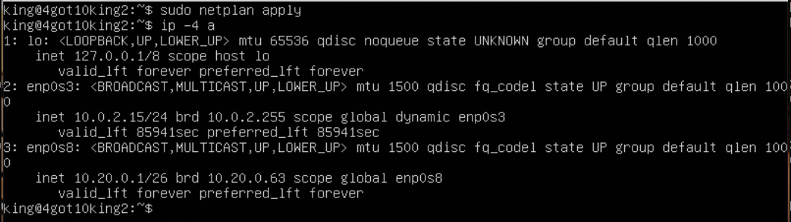
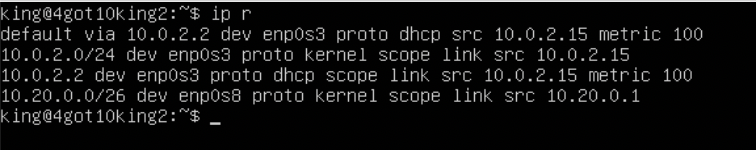
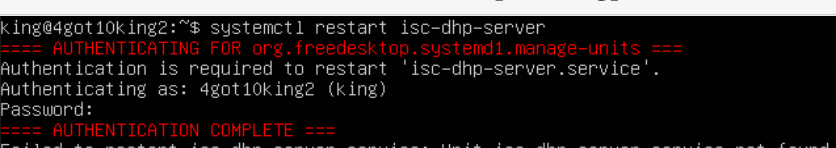
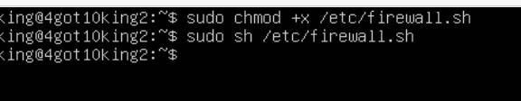

LinuxNetwork

## Part 1. Инструмент ipcalc
### 1.1. Сети и маски

1) Адрес сети 192.167.38.54/13

+ Скачиваем утилиту **ipcalc**

+ Для вывода адреса сети воспользуемся `ipcalc -b 192.167.38.54/13`

*Флаг `-b` позволяет скрыть двоичный вывод*

2) Перевод маски 255.255.255.0 в префиксную и двоичную запись, /15 в обычную и двоичную, 11111111.11111111.11111111.11110000 в обычную и префиксную

+ Воспользуемся командой `ipcalc 255.255.255.0`

*Префиксная запись `/24`. Двоичная запись - `11111111.11111111.11111111.00000000`*

+ Воспользуемся командой `ipcalc /15`

Обычная запись - `255.254.0.0`. Двоичная запись - `11111111.11111110.00000000.00000000`

+ Посчитаем количество ненулевых бит в 11111111.11111111.11111111.11110000 и получим - 28. Воспользуемся командой `ipcalc 192.167.38.54/28`

*Обычная запись - `255.255.255.240`. Префиксная запись - `/28`.*

3) Минимальный и максимальный хост в сети 12.167.38.4 при масках: /8, 11111111.11111111.00000000.00000000, /4

+ Воспользуемся командой ipcalc `12.167.38.4/8`

*Минимальный хост - `12.0.0.1`. Максимальный хост - `12.255.255.254`.*

+ Воспользуемся командой ipcalc `12.167.38.4/16`

Минимальный хост - `12.167.0.1`. Максимальный хост - `12.167.255.254`.

+ Воспользуемся командой `ipcalc 12.167.38.4/23`

*Минимальный хост - `12.167.38.1`. Максимальный хост - `12.167.39.254`.*

+ Воспользуемся командой `ipcalc 12.167.38.4/4`

*Минимальный хост - `0.0.0.1`. Максимальный хост - `15.255.255.254`.*

### 1.2. Localhost

+ Пишем в гугле "localhost" и в первой ссылке на википедию видим, что для localhost зарезервирован диапазон ip адресов от 127.0.0.1 до 127.255.255.254 включительно. Из этого можем сделать вывод, что мы сможем обратиться к приложениям, работающим со следующими ip: `127.0.0.2`, `127.1.0.1`.
Проверим:

+ Воспользуемся командой `ipcalc 194.34.23.100`

*Интерфейс loopback отсутствует в строке "Hosts/Net", следовательно данный адрес нам не подходит.*

+ Воспользуемся командой `ipcalc 127.0.0.2`

*Loopback присутствует, следовательно адрес нам подходит.*

+ Воспользуемся командой `ipcalc 127.1.0.1`

*Loopback тоже есть, следовательно адрес нам подходит.*

+ Воспользуемся командой `ipcalc 128.0.0.1`

*Loopback нет, адрес не подходит.*

### 1.3. Диапазоны и сегменты сетей

1) Какие из перечисленных IP можно использовать в качестве публичного, а какие только в качестве частных: 10.0.0.45, 134.43.0.2, 192.168.4.2, 172.20.250.4, 172.0.2.1, 192.172.0.1, 172.68.0.2, 172.16.255.255, 10.10.10.10, 192.169.168.1

*Нас интересует строка "Hosts/Net" и конкретно надпись "Private Internet", наличие которой говорит о том, что ip адрес принадлежит частной сети.
Вывод:*

+ Адреса `10.0.0.45`, `192.168.4.2`, `172.20.250.4`, `172.16.255.255`, `10.10.10.10` можно использовать только в качестве частных.
+ Адреса `134.43.0.2`, `172.0.2.1`, `192.172.0.1`, `172.68.0.2`, `192.169.168.1` можно использовать в качестве публичных.

2) Какие из перечисленных IP адресов шлюза возможны у сети 10.10.0.0/18: 10.0.0.1, 10.10.0.2, 10.10.10.10, 10.10.100.1, 10.10.1.255

+ Воспользуемся командой `ipcalc -b 10.10.0.0/18`

Возможны адреса `10.10.0.2`, `10.10.10.10` и `10.10.1.255`

## Part 2. Статическая маршрутизация между двумя машинами

Поднять две виртуальные машины (далее -- 4got10king и 4got10king2)

С помощью команды ip a посмотреть существующие сетевые интерфейсы

+ 4got10king

+ 4got10king2 

Описать сетевой интерфейс, соответствующий внутренней сети, на обеих машинах и задать следующие адреса и маски: 4got10king - 192.168.100.10, маска /16, 4got10king2 - 172.24.116.8, маска /12

+ На обеих машинах выполняем команду sudo nano `/etc/netplan/00-installer-config.yaml` и вносим изменения.

+ 4got10king

+ 4got10king2

Выполнить команду netplan apply для перезапуска сервиса сети

+ 4got10king

+ 4got10king2

### 2.1. Добавление статического маршрута вручную

Добавить статический маршрут от одной машины до другой и обратно при помощи команды вида ip r add

+ Команда для 4got10king: `sudo ip r add 172.24.116.8 via 192.168.100.10 dev enp0s8`

+ Команда для 4got10king2: `sudo ip r add 192.168.100.10 via 172.24.116.8 dev enp0s8`

Пропинговать соединение между машинами

+ 4got10king

+ 4got10king2

### 2.2. Добавление статического маршрута с сохранением

Перезапустить машины

+ Используем команду `sudo reboot`

Добавить статический маршрут от одной машины до другой с помощью файла etc/netplan/00-installer-config.yaml

+ 4got10king

+ 4got10king2

Пропинговать соединение между машинами

+ 4got10king

+ 4got10king2

## Part 3. Утилита iperf3

### 3.1. Скорость соединения

Перевести и записать в отчёт: 8 Mbps в MB/s, 100 MB/s в Kbps, 1 Gbps в Mbps

+ 8 Mbps = 1 MB/s
+ 100 MB/s = 819200 Kbps
+ 1 Gbps = 1024 Mbps

### 3.2. Утилита iperf3

Измерить скорость соединения между 4got10king и 4got10king2

+ 4got10king выступает в роли сервера. Запуск iperf3 сервер, команда: `iperf3 -s -f m`

+ 4got10king2 выступает в роли клиента. Запуск iperf3 клиент, команда: `iperf3 -c 192.168.100.10`

## Part 4. Сетевой экран

### 4.1. Утилита iptables

Создать файл /etc/firewall.sh, имитирующий фаерволл, на 4got10king и 4got10king2:

Нужно добавить в файл подряд следующие правила:

1. на 4got10king применить стратегию когда в начале пишется запрещающее правило, а в конце пишется разрешающее правило (это касается пунктов 4 и 5)

2. на 4got10king2 применить стратегию когда в начале пишется разрешающее правило, а в конце пишется запрещающее правило (это касается пунктов 4 и 5)

3. открыть на машинах доступ для порта 22 (ssh) и порта 80 (http)

4. запретить echo reply (машина не должна "пинговаться”, т.е. должна быть блокировка на OUTPUT)

5. разрешить echo reply (машина должна "пинговаться")

+ добавляем правила для 4got10king:

Запрещаем echo-reply, открываем доступ для портов 22 и 80, разрешаем echo-reply.

+ добавляем правила для 4got10king2:

Разрешаем echo-reply, открываем доступ для портов 22 и 80, запрещаем echo-reply.

Запустить файлы на обеих машинах командами `chmod +x /etc/firewall.sh` и `/etc/firewall.sh`

+ запускаем файл на 4got10king, не забываем дописать `sudo`

+ запускаем файл на 4got10king2 тоже с `sudo`

+ Разница между стратегиями заключается в том, что в первом файле первым подходящим правилом для пакета является запрет, а во втором - разрешение. Применяется только первое подходящее правило, остальные игнорируются.

### 4.2. Утилита nmap

Командой ping найти машину, которая не "пингуется", после чего утилитой nmap показать, что хост машины запущен

*Проверка:* в выводе nmap должно быть сказано: `Host is up`

+ пингуем 4got10king с 4got10king2

+ пингуем 4got10king с 4got10king2 и видим, что машина не "пингуется". Сразу проверяем утилитой nmap.

Видим заветное сообщение `Host is up`

## Part 5. Статическая маршрутизация сети

Поднять пять виртуальных машин (3 рабочие станции (4got10king, 4got10king2, 4got10king3) и 2 роутера (rou, rou2))

### 5.1. Настройка адресов машин

Настроить конфигурации машин в etc/netplan/00-installer-config.yaml согласно сети на рисунке.

+ 4got10king 

+ rou

+ 4got10king2 

+ 4got10king3

+ rou2

Перезапустить сервис сети. Если ошибок нет, то командой `ip -4 a` проверить, что адрес машины задан верно. Также пропинговать 4got10king3 с 4got10king2. Аналогично пропинговать rou с 4got10king.

+ 4got10king и пинг rou

+ rou

+ 4got10king2

+ 4got10king3

+ rou2

### 5.2. Включение переадресации IP-адресов.

Для включения переадресации IP, выполните команду на роутерах: 

`sysctl -w net.ipv4.ip_forward=1`

+ ввод на rou

+ ввод на rou2

Откройте файл /etc/sysctl.conf и добавьте в него следующую строку:

`net.ipv4.ip_forward = 1`

+ rou 

+ rou2 

### 5.3. Установка маршрута по-умолчанию

Настроить маршрут по-умолчанию (шлюз) для рабочих станций. Для этого добавить default перед IP роутера в файле конфигураций

+ добавляем шлюз для 4got10king

+ для 4got10king2

+ для 4got10king3

также потребовалось добавить шлюзы для роутеров, чтобы пинг доходил в соседнюю сеть.

+ rou

+ rou2

Вызвать ip r и показать, что добавился маршрут в таблицу маршрутизации

+ 4got10king

+ 4got10king2

+ 4got10king3

роутеры 

+ rou

+ rou2

Пропинговать с 4got10king роутер rou2 и показать на rou2, что пинг доходит. Для этого использовать команду:
`tcpdump -tn -i eth1`
Изменим eth1 на название нашего адаптера enp0s9 и пингуем:

+ 4got10king 

+ rou2 

### 5.4. Добавление статических маршрутов

Добавить в роутеры rou и rou2 статические маршруты в файле конфигураций. Пример для rou маршрута в сетку 10.20.0.0/26:

Добавить в конец описания сетевого интерфейса eth1:
- to: 10.20.0.0  
  via: 10.100.0.12 

Добавленные маршруты для роутеров rou и rou2

+ rou

+ rou2

Вызвать ip r и показать таблицы с маршрутами на обоих роутерах.

+ rou

+ rou2

Запустить команды на 4got10king:

`ip r list 10.10.0.0/[маска сети]` и `ip r list 0.0.0.0/0`

+ команда `ip r list 10.10.0.0/[маска сети]`

+ команда `ip r list 0.0.0.0/0`

+ Маршрут по умолчанию имеет более низкий приоритет и срабатывает, когда не найден подходящий маршрут в таблице маршрутизации. Для сети 10.10.0.0 мы создали правило, соответственно используется созданный маршрут. Также можно устанавливать метрику, чтобы менять приоритеты маршрутов.

### 5.5. Построение списка маршрутизаторов

Запустить на rou команду дампа:
`tcpdump -tnv -i eth0`

При помощи утилиты traceroute построить список маршрутизаторов на пути от 4got10king до 4got10king2

в первую очередь установим утилиту traceroute командой `sudo apt install traceroute`

+ вызов и вывод traceroute на 4got10king

+ вызов и вывод tcpdump -tnv -i enp0s9 на rou

+ Принцип построения пути при помощи traceroute:
Для определения промежуточных маршрутизаторов traceroute отправляет серию пакетов данных целевому узлу, при этом каждый раз увеличивая на 1 значение поля TTL («время жизни»). Это поле обычно указывает максимальное количество маршрутизаторов, которое может быть пройдено пакетом. Первый пакет отправляется с TTL, равным 1, и поэтому первый же маршрутизатор возвращает обратно сообщение ICMP, указывающее на невозможность доставки данных. Traceroute фиксирует адрес маршрутизатора, а также время между отправкой пакета и получением ответа (эти сведения выводятся на монитор компьютера). Затем traceroute повторяет отправку пакета, но уже с TTL, равным 2, что позволяет первому маршрутизатору пропустить пакет дальше.
Процесс повторяется до тех пор, пока при определённом значении TTL пакет не достигнет целевого узла. При получении ответа от этого узла процесс трассировки считается завершённым.

### 5.6. Использование протокола ICMP при маршрутизации

Запустить на rou перехват сетевого трафика, проходящего через eth0 с помощью команды: 

`tcpdump -n -i eth0 icmp`

Пропинговать с 4got10king несуществующий IP (например, 10.30.0.111) с помощью команды:

`ping -c 1 10.30.0.111`

+ tcpdump на rou

+ 

## Part 6. Динамическая настройка IP с помощью DHCP

Для rou2 настроить в файле /etc/dhcp/dhcpd.conf конфигурацию службы DHCP:

+ для начала скачаем isc-dhcp-server командой `sudo apt install isc-dhcp-server`

1. указать адрес маршрутизатора по-умолчанию, DNS-сервер и адрес внутренней сети.

+ вносим изменения в файл /etc/dhcp/dhcpd.conf

2.  в файле resolv.conf прописать nameserver 8.8.8.8.

+ вносим изменения в файл /etc/resolv.conf

Перезагрузить службу DHCP командой `systemctl restart isc-dhcp-server`. Машину 4got10king2 перезагрузить при помощи reboot и через ip a показать, что она получила адрес. Также пропинговать 4got10king3 с 4got10king2.

+ перезагружаем службу DHCP

+ Перезагружаем 4got10king2 с помощью команды `sudo reboot` и вызываем команду `ip a`

ip адрес получен

+ пингуем 4got10king3 с 4got10king2

Указать MAC адрес у 4got10king, для этого в etc/netplan/00-installer-config.yaml надо добавить строки: macaddress: 10:10:10:10:10:BA, dhcp4: true

+ вносим изменения в в */etc/netplan/00-installer-config.yaml*

Для rou1 настроить аналогично rou2, но сделать выдачу адресов с жесткой привязкой к MAC-адресу (4got10king). Провести аналогичные тесты

+ Снова скачиваем isc-dhcp-server и вносим изменения в файл */etc/dhcp/dhcpd.conf*

+ затем редактируем файл /etc/resolv.conf

+ перезагружаем службу DHCP

+ перезагружаем 4got10king и вызываем `ip a`

+ пингуем 4got10king2

Запросить с 4got10king2 обновление ip адреса

+ `ip a` на 4got10king2 до обновления

+ вызываем команду `sudo dhclient enp0s8 -r`, потом `sudo dhclient enp0s8` и снова `ip a`

+ в данном пункте пользовался опцией -r для того, чтобы очистить список ip адресов.

## Part 7. NAT

Устанавливаем apache2

В файле /etc/apache2/ports.conf на 4got10king3 и rou изменить строку Listen 80 на Listen 0.0.0.0:80, то есть сделать сервер Apache2 общедоступным

+ 4got10king3 

+ rou

Запустить веб-сервер Apache командой `service apache2 start` на 4got10king3 и rou

+ 4got10king3 

+ rou

Добавить в фаервол, созданный по аналогии с фаерволом из Части 4, на rou2 следующие правила:

1. Удаление правил в таблице filter - iptables -F
2. Удаление правил в таблице "NAT" - iptables -F -t nat
3. Отбрасывать все маршрутизируемые пакеты - iptables --policy FORWARD DROP

Запускать файл также, как в Части 4

Проверить соединение между 4got10king3 и rou командой ping

Добавить в файл ещё одно правило:
4. Разрешить маршрутизацию всех пакетов протокола ICMP

Запускать файл также, как в Части 4

Проверить соединение между 4got10king3 и rou командой ping

Добавить в файл ещё два правила:

5. Включить SNAT, а именно маскирование всех локальных ip из локальной сети, находящейся за rou2 (по обозначениям из Части 5 - сеть 10.20.0.0)

6. Включить DNAT на 8080 порт машины rou2 и добавить к веб-серверу Apache, запущенному на 4got10king3, доступ извне сети

Запускать файл также, как в Части 4

Проверить соединение по TCP для SNAT, для этого с 4got10king3 подключиться к серверу Apache на rou командой:

`telnet [адрес] [порт]`

Проверить соединение по TCP для DNAT, для этого с rou подключиться к серверу Apache на 4got10king3 командой `telnet` (обращаться по адресу rou2 и порту 8080)

## Part 8. Дополнительно. Знакомство с SSH Tunnels

Запустить на rou2 фаервол с правилами из Части 7

+ смотрим правила фаервола

+ и запускаем его

Запустить веб-сервер Apache на 4got10king3 только на localhost (то есть в файле */etc/apache2/ports.conf* изменить строку `Listen 80` на `Listen localhost:80`)

+ вносим изменения в файл

+ запускаем веб-сервер

Воспользоваться Local TCP forwarding с 4got10king2 до 4got10king3, чтобы получить доступ к веб-серверу на 4got10king3 с 4got10king2

+ воспользуемся командой `ssh -L [local_port]:localhost:[local_port] [remote_ip]`

Воспользоваться Remote TCP forwarding c 4got10king до 4got10king3, чтобы получить доступ к веб-серверу на 4got10king3 с 4got10king

+ воспользуемся командой `ssh -R [remote_port]:localhost:[local_port] [remote_ip]`

